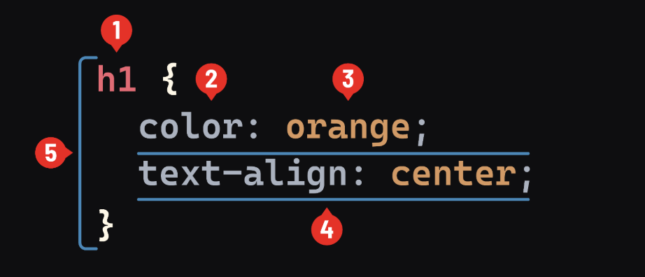

# Review of CSS

## What is CSS?

CSS (Cascading Style Sheets) is a stylesheet language used to describe the presentation of a document written in HTML. CSS defines how elements should be rendered on screen. This language is one of the core technologies of the web, alongside HTML and JavaScript.

### Brief History of CSS

CSS was first proposed by Håkon Wium Lie on October 10, 1994. At the time, the web was beginning to grow, but there was no simple way to add style to web pages. CSS was designed to enable the separation of presentation and content, including layout, colors, and fonts. This separation improves content accessibility, provides more flexibility and control in the specification of presentation characteristics, and reduces complexity and repetition in the structural content.

## CSS Selectors

### Using Tag Selectors

Tag selectors, also known as type selectors, target HTML elements based on their tag name. This is the most straightforward way to select elements and apply styles universally to those elements.

### Example of Tag Selectors

Let's say you want all `<h1>` headers on your page to have a specific style. You can do this by using the `<h1>` tag as a selector in your CSS. Here's how you might write that:

```css
h1 {
  color: blue;
  font-size: 24px;
  text-align: center;
}
```

This CSS rule applies to all `<h1>` elements on the page, setting their text color to blue, their font size to 24 pixels, and aligning the text to the center.

Let's break down the basic syntax.

### CSS Syntax

Here is breakdown of how we define a CSS rule:



- _Selectors (1)_: Used to target the element(s) to be styled and range from simple to incredibly complex.
- _Properties (2)_: There are many built-in properties that can be used to style elements.
- _Value (3)_: The value assigned to the color property controls the color of an element's text.
- _Declaration (4)_: The combination of a property and value, separated by a colon and ending with a semicolon, makes a declaration.
- _CSS Rule (5)_: A syntax system composed of a selector and all of its associated style declarations.

### Additional Selectors

We've already used element selectors like `p` and `h2` to target specific HTML elements on a web page. This allowed us to style those elements in any way we wanted. `id` and `class` selectors let us narrow down the elements we want to select. For example, instead of selecting every `<div>` in our HTML, we can select only the `<div>` elements that have specific `id` or `class` attributes.

## Getting Specific With It

We can get specific with our styling by adding some more information to our code: **classes** and **IDs**. We’ll add a class or ID label to an element’s HTML tag, then refer to that label in the CSS. By doing so, we can target that specific instance with any styling we want.

Here’s what that looks like:

```html
// We can take this element:
<h2>Welcome to my portfolio!</h2>

// And give it a class like this:
<h2 class="first-header">Welcome to my portfolio!</h2>
```

Let’s see how each label works.

## Working with IDs

An **ID** lets us specify a unique label so that we can apply distinct styles to _just one thing_. You can add an ID to any part of your HTML in order to single it out, then target that ID in the CSS using the `#` character.


**Remember**: IDs must be _unique_! That is, we can only use the `#very-unique` ID once in the HTML. If we wanted to specify other `<p>` elements, we’d have to give them different IDs. As such, you should avoid using IDs unless you _know for certain_ the element is going to be unique.

## Working with Classes

On the other hand, a **class** lets us label several elements as belonging to the same group. You can use the same class throughout your HTML in order to apply the same style to many elements, and then target that class in CSS using the `.` character.


**Pro tip**: Use a class if you know that you’ll have several similar elements on your webpage — for example, several lists you want to look the same, or several images you want to be the same size. You’ll only need to write _one set of styles_ for that class and it will apply to all tagged elements.

## Overruled!

When we start using more specific selectors, such as classes and ids, it's possible to have several, conflicting CSS rules that would target the same element. In that case, the **most specific selector** always wins. In the example below, the p tag would be colored purple and sized 16px, because ids are more specific than classes, and classes are more specific than element selectors.

```html
<p class="medium-size" id="purple">I'm so conflicted!</p>
```

```css
p {
  font-size: 12px;
  color: blue;
}
.medium-size {
  font-size: 16px;
  color: green;
}
#purple {
  color: purple;
}
```

## Specificity

Specificity is a way the browser decides which CSS rule gets applied when there is a conflict. For example:

```css
.my-class {
    color: blue;
}

div {
    color: red;
}

<div class="my-class">What color am I?</div>
```

A conflict exists because the same `<div>` has two css selectors applied with a color.

The selector with the highest _specificity_ wins.

Specificity is based upon the following priorities, where priority A has highest specificity and priority D has the lowest specificity:

- Priority A: inline styling
- Priority B: IDs
- Priority C: Classes, attributes, & pseudo-classes
- Priority D: Elements

So, in the above example, we'd expect the `div` to be blue, as classes take have a higher specificity than elements.
