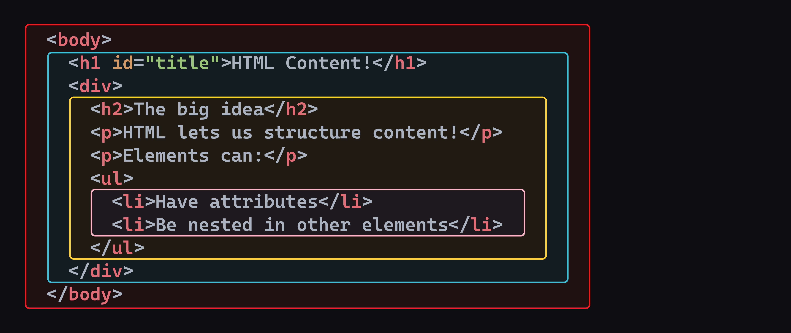

## Nesting elements

Elements can also be placed inside one another, like how we placed the `<h1>` element inside the `<body>` element below. This is called nesting.

```html
<body>
  <h1>HTML Content!</h1>
</body>
```

We can continue nesting elements inside of one another.

```html
<body>
  <h1>HTML Content!</h1>
  <div>
    <h2>The big idea</h2>
    <p>HTML lets us structure content!</p>
  </div>
</body>
```

Here, we've nested a `<div>` inside the `<body>`. `<div>` is a generic container element used to group content together. Inside of the `<div>`, there is an `<h2>` and a `<p>` element. The `<p>` element represents a paragraph of text.

You ***must*** indent nested elements. Properly indenting elements makes the markup far more readable and less prone to errors.

Some elements, like the list item `<li>` element, must be nested inside another element, like the unordered list `<ul>` element. For example:

```html
<body>
  <h1>HTML Content!</h1>
  <div>
    <h2>The big idea</h2>
    <p>HTML lets us structure content!</p>
    <p>Elements can:</p>
    <ul>
      <li>Have attributes</li>
      <li>Be nested in other elements</li>
    </ul>
  </div>
</body>
```

> 🧠 Above, nested elements all have their own line, but this is not strictly required.
> Here's an example of a `<p>` element with text and a nested `<span>` element all on the same line:
>
> ```html
> <p>Have a <span>great</span> day!</p>
> ```

### Nested relationships



When elements are nested, they form relationships with one another.

- **Descendant / Ancestor:** An element is a descendant if it is nested anywhere within its ancestor.
- **Child / Parent:** An element is a child if it is a direct descendant of its parent.
- **Siblings:** Two or more elements are siblings if they have the same parent.