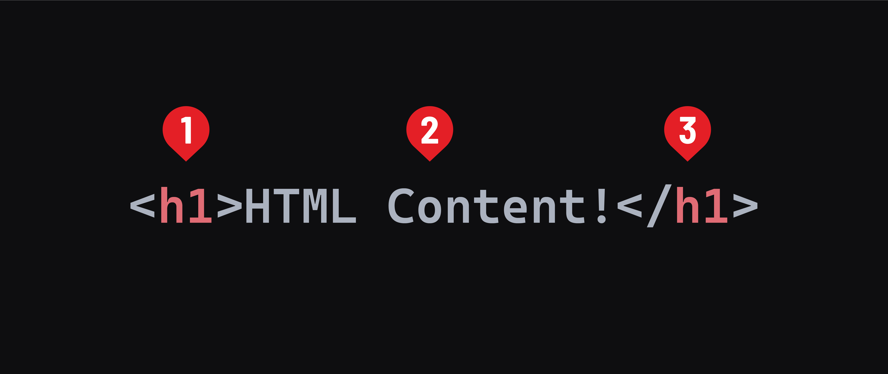

## Review HTML

### Brief History

HTML was created by Tim Berners-Lee in the early 1990s as a way for academics and researchers to share documents and research papers over the internet. Its design allows for the embedding of hyperlinks, enabling easier access to related information, which was revolutionary for academic collaboration at the time. It requrires us to write in a specific syntax that is then interpreted by the browser.

### Element syntax

We'll talk more about the HTML boilerplate you created soon; for now add everything between the `<body>` and `</body>` (or CodePen HTML panel). Content here will show up in the browser!

HTML documents are made up of elements.

At their simplest, elements are a pair of tags with content between them.



1. The opening tag. The tag itself starts with a `<` and ends with a `>`. Tags must also include the element name, like `h1` above. This indicates the start of an element.
2. The content of an element, `HTML Content!` here.
3. The closing tag. The tag starts with a `</` (note the addition of the slash) and ends with a `>`. The closing tag also includes the element name between. It matches the element name of the opening tag.

These things combined create an element.

Most elements have a semantic meaning (more on that later), and some default styling implemented by the browser. For example, an `<h1>` element indicates the main topic of a webpage. Along with this, its text content is bold, and its default font size is larger than any other text element.

Element names are always lowercase.

### Void elements

Some elements won't ever have text content. These are called void elements. Because they will not have text content, they do not have a closing tag. One such element is the `<hr>` element, which creates a horizontal rule.

```html
<hr />
```

You may see void elements written with a space and closing `/` added to the end of the tag. This is valid but not required.

```html
<hr />
```

We also have nested elements, but more on that in a later lesson.

## HTML Tags Galore

There are dozens of HTML elements, each with their own unique purpose. Here are just a few of the tags we use to define them:

| Type                | Tag         | Description                                                                                                |
| ------------------- | ----------- | ---------------------------------------------------------------------------------------------------------- |
| Content Tags        | `<h1-6>`    | Creates heading text, with `<h1>` being the largest and `<h6>` the smallest.                               |
|                     | `<p>`       | Creates a paragraph of text.                                                                               |
|                     | `<li>`      | Indicates each list item inside of a `<ul>` or `<ol>`.                                                     |
|                     | `<a>`       | Defines a hyperlink, used to link from one page to another or to a section within the same page.           |
| Void Tags           | ``     | Adds an image.                                                                                             |
|                     | `<br>`      | Creates a line break.                                                                                      |
| Nested Element Tags | `<div>`     | Defines a new section on the page.                                                                         |
|                     | `<ul>`      | Begins an “unordered list” (e.g., bullets).                                                                |
|                     | `<ol>`      | Begins an “ordered list” (e.g., numbers).                                                                  |
|                     | `<article>` | Specifies independent, self-contained content.                                                             |
|                     | `<section>` | Defines sections in a document, such as chapters, headers, footers, or any other sections of the document. |
|                     | `<header>`  | Represents introductory content or navigational links.                                                     |
|                     | `<footer>`  | Represents the footer of a section or document.                                                            |
|                     | `<nav>`     | Defines navigation links.                                                                                  |

You might be wondering how you’ll ever remember all of those tags. Not to worry, you don’t have to!

You’ll learn some tags from frequent use; others you’ll never touch. And still others you can simply look up as needed. Tons of websites publish lists of HTML tags for easy reference. We recommend bookmarking [this handy one](https://www.w3schools.com/tags/).

And remember, even experienced web designers sometimes have to look up tags while coding!

### Example HTML Document

Here is an example of an HTML document that uses many of the commonly discussed tags:

```html
<!DOCTYPE html>
<html lang="en">
  <head>
    <meta charset="UTF-8" />
    <meta name="viewport" content="width=device-width, initial-scale=1.0" />
    <title>Example Page</title>
  </head>
  <body>
    <!-- Main header of the page -->
    <header>
      <h1>Welcome to My Website</h1>
      <nav>
        <ul>
          <li><a href="#home">Home</a></li>
          <li><a href="#about">About</a></li>
          <li><a href="#contact">Contact</a></li>
        </ul>
      </nav>
    </header>

    <!-- Main content area -->
    <section>
      <article id="home">
        <h2>Introduction</h2>
        <p>This is a sample introduction to my web page.</p>
      </article>
      <article id="about">
        <h2>About Us</h2>
        <p>More detailed information about our website and its purpose.</p>
      </article>
    </section>

    <!-- Footer with contact information -->
    <footer>
      <p id="contact">
        Contact us at <a href="mailto:info@example.com">info@example.com</a>.
      </p>
    </footer>
  </body>
</html>
```
