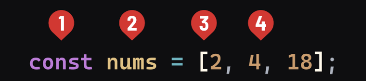

# JavaScript Data Types - Arrays

## Introduction

Arrays in JavaScript are used to store multiple values in a single variable. They are ideal for holding an ordered list of items and are a subtype of the Object type.

## Creating Arrays

Arrays are created using square brackets and can contain zero or more elements, which are separated by commas. It is recommended to use the `const` keyword when declaring arrays as it prevents the reassignment of the array identifier.



### Steps to Create an Array

1. **Use the `const` keyword**: Arrays should always be declared using `const` to avoid reassignment.
2. **Array Naming**: The name of the array should be plural to indicate it can hold multiple items.
3. **Square Brackets**: Arrays are defined using opening and closing square brackets (`[]`).
4. **Initializing Elements**: Place the elements inside the brackets, separated by commas.

**Example:**

```javascript
const fruits = ["Apple", "Banana", "Cherry"];
```

### Accessing Elements

Elements in an array are accessed using their index, which starts at 0 for the first element. Each subsequent element has an index incremented by one.

**Example:**

```javascript
let firstFruit = fruits[0]; // Accesses the first element, "Apple"
console.log(firstFruit); // Outputs: Apple
```

### The `length` Property

The `length` property of an array returns the number of elements it contains.

**Example:**

```javascript
console.log(fruits.length); // Outputs: 3
```

## Adding or Removing Elements

### Adding Elements at the End

The `push()` method adds one or more elements to the end of an array and returns the new length.

**Example:**

```javascript
fruits.push("Date");
console.log(fruits); // Outputs: ["Apple", "Banana", "Cherry", "Date"]
```

### Removing Elements at the End

The `pop()` method removes the last element from an array and returns that element.

**Example:**

```javascript
let lastFruit = fruits.pop();
console.log(lastFruit); // Outputs: "Date"
console.log(fruits); // Outputs: ["Apple", "Banana", "Cherry"]
```

## Conclusion

Arrays are powerful structures for managing ordered data in JavaScript. Understanding how to manipulate arrays using methods like `push()` and `pop()`, and properties like `length`, can greatly enhance your ability to handle data efficiently in your applications.
