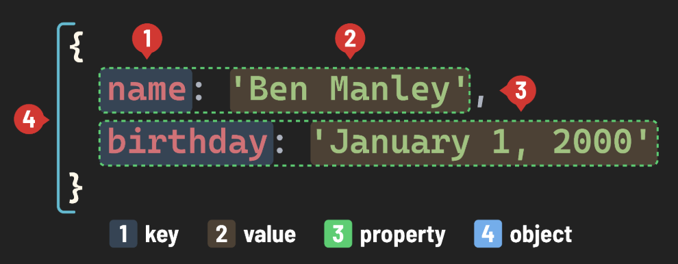

# JavaScript Data Types - Objects

## Introduction

In JavaScript, objects are fundamental data structures used to store related data. They are essentially collections of properties, where each property is a key-value pair.

## What is a Property?

A property consists of a key and a value:

- **Key**: Acts as an identifier and must be a string. If any other type is used as a key, it will be coerced into a string.
- **Value**: Can be any JavaScript expression that evaluates to a single value. This includes simple data types like strings, numbers, and booleans, as well as objects and functions. When a function is bound to an object, it is referred to as a method.



## Creating and Accessing Values

Objects in JavaScript can be interacted with primarily through dot notation, which is used for accessing, creating, or reassigning values.

### Dot Notation

Use dot notation to access properties of an object. The format is `object.key`.

**Example:**

```javascript
let person = {
  name: "Alice",
  age: 25,
};

console.log(person.name); // Outputs: Alice
```

### Updating/Creating Properties

You can assign a new value to a property using the assignment operator (=). If the property exists, it updates; if not, it creates a new property.

**Example:**

```javascript
// Updating an existing property
person.age = 30;
console.log(person.age); // Outputs: 30

// Creating a new property
person.height = "5ft";
console.log(person.height); // Outputs: 5ft
```

## Practice

Now, let's put what you've learned into practice. Write the following code:

### Task

Create an object named favAlbum containing four properties:

1. The key "name" with a value with the name of the album.
2. The key "tracks" with a value with the number of tracks in the album.
3. The key "favTrack" with a value of your favorite song in the album.
4. The key "onSpotify" with a boolean value of true or false.

<details>
<summary>Sample Solution</summary>

```javascript
let favAlbum = {
  name: "Thriller",
  tracks: 9,
  favTrack: "Billie Jean",
  onSpotify: true,
};

console.log(favAlbum);
```

</details>

## Conclusion

Objects are incredibly versatile and essential in JavaScript for organizing data. They allow for the structured representation of real-world data, making your programs more intuitive and maintainable.
