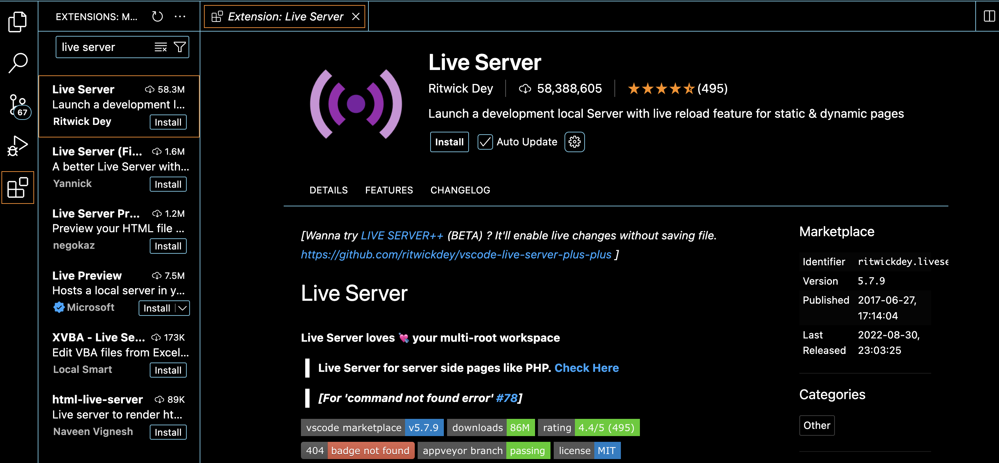

# Viewing Your HTML in the Browser

## Testing and Viewing Your HTML

It's essential to view your HTML file in a browser to see how your web application looks and behaves. There are a couple of ways to open your HTML file in a browser:

- **Manually Opening the File**: Right-click on the HTML file and select "Open with" and then choose your preferred browser.
- **Using a Live Server**: This is the recommended method as it provides a live preview of your changes.

### Live Server

To install `Live Server`, add the extension from VS Code's extension library. This tool automatically refreshes your page whenever you make and save changes.



After you have installed `Live Server`, click on "Go Live" in the bottom right of your VS Code.


Let's make sure we connected our CSS and JS files accurately by adding sample code.

### Styling Elements

Select the `<h1>` element in the HTML document and change its background color in your CSS file:

```css
h1 {
  background-color: hotpink;
}
```

Once you save your changes, you should immediately see the updates from the CSS file reflected in your browser.

### Adding JavaScript

In your `script.js` file, add a console.log statement to print a message to the console:

```javascript
console.log("Hello World!");
```

After saving our work in the JavaScript file, you might notice that nothing appears on the screen. This is because console logs are intended for developers and do not display on the webpage itself. To view our printouts, we need to open our console in the browser's developer tools. We'll cover more on this in the next lesson.
