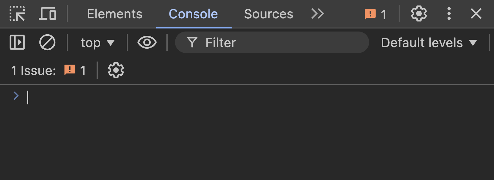

# Using Developer Tools

Once you have your web application open in the browser:

1. Right-click anywhere on the page and select `"Inspect"` or press `Ctrl+Shift+I` (Windows) or `Cmd+Option+I` (Mac) to open developer tools.
2. Go to the `"Console"` tab to see the output from your JavaScript file.

If you see the message 'Hello World!', you're all set! Congratulations—you can now develop in your own environment from scratch!
